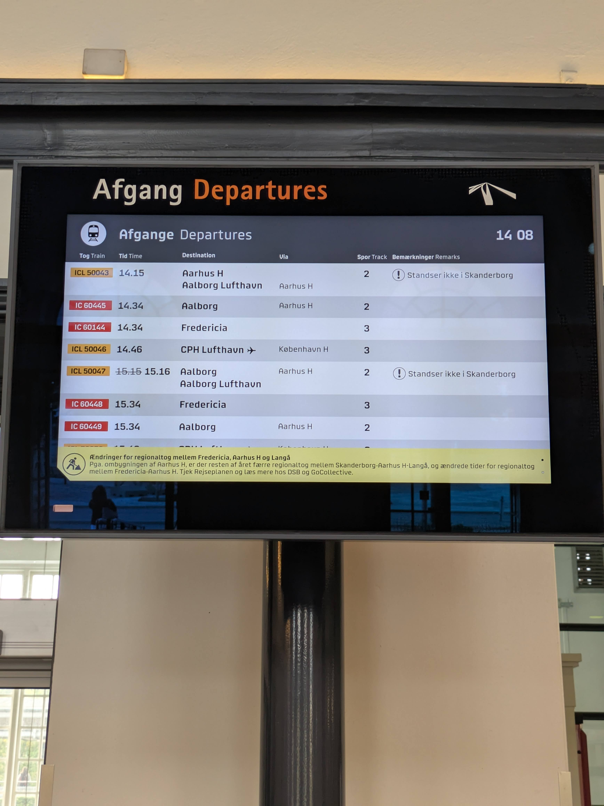
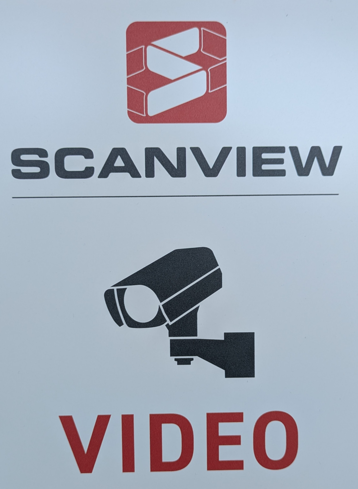
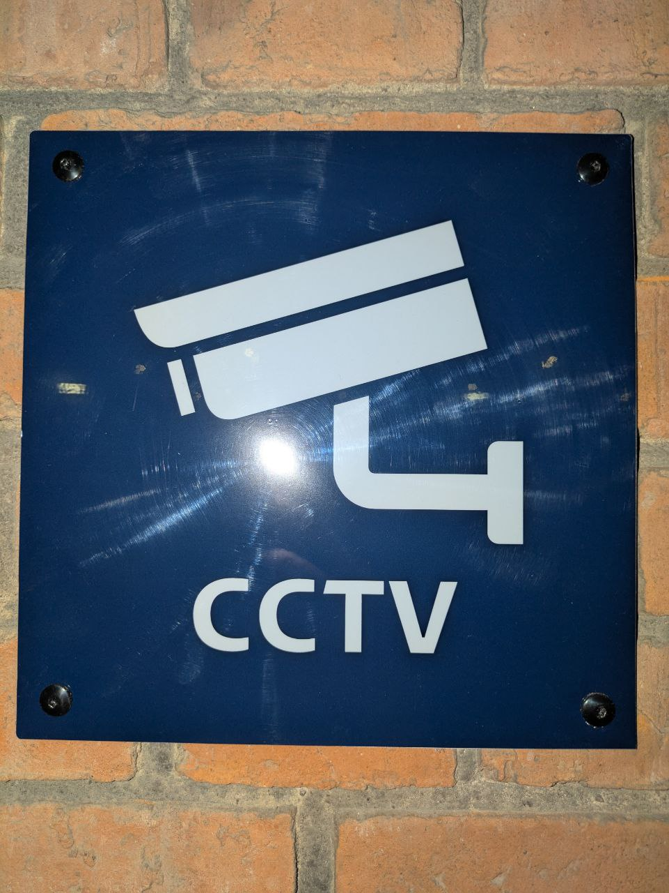

## 3D Scanning
Before any setup was done in Unity, we decided to get a 3d model of the Horsens St.

For the 3D scanning process, we used a borrowed **iPhone 14 Pro** from XRD lab, which includes a built-in LiDAR sensor capable of capturing accurate spatial data. To create our scans, we used the application [3D Scanner App](https://3dscannerapp.com/).

We began by scanning the **main hall** of the Horsens train station, then continued into the **tunnel**, and finally scanned **each platform separately**.  
The scanned models were exported as **.obj** files and later processed in **Blender**.  
For use in Unity, we worked with the cleaned and optimized models in **.fbx** format.

## Implementation overview (from scan to AR navigation)

At a high level, our pipeline was:

1. **Scan** the station spaces (main hall, tunnel, platforms) using LiDAR.
2. **Clean and optimize** the meshes in Blender (fix scale/rotation, remove noise, simplify geometry).
3. **Import** the optimized **.fbx** models into Unity (keeping consistent units and orientation).
4. **Bake a navigation mesh** on the walkable surfaces of the scan so Unity could compute routes.
5. **Localize the user** by detecting a real-world reference image and aligning the virtual content to that tracked pose.

## Learning Unity

Both team members were completely unexperienced with Unity. While we got the theoretical knowledge from the lectures, we had to start by learning the Unity editor interface from scratch (which was especially challenging on smaller screens).

### Hardware limitations
While Unity is a software designed to run on both Windows and macOS, our devices, specially Hugo's were not powerful enough to handle Unity with ease. Build times of 2 minutes, changing a small piece of code results in Unity compiling for over 30s, unresponsive editor UI... There were the kinds of problems we could face which not only slowed down development, also made us lose concentration, which harmed even more the development of the project.

### Importing the 3d model
Once we had a 3d scan of Horsens St., we had to import it into the scene in Unity. We just dragged the whole file, and a new Game Object was created. All we had to do after is create a new transparent material so all that it's shown in the device is the wayfinding line.

### Creating the Navigation Mesh

Before starting the project, we thought that we would have to manually find the path between the user and the target. Thankfully, thanks to the great community around Unity, we found the platform already equips a system to calculate paths given a walkable surface. This was great news and all we had to do was bake the navigation mesh on our files.

We baked the navigation mesh on the station’s **walkable geometry** (floors/stairs), and then tuned the agent settings to get better traversal behavior.

Finally, small adjustements were done in the avatar configuration, as the stairs were showing with too much incline for the user to climb. So we set that the avatar can climb up to 2 meters high walls, avoiding issues with the stairs leading to the station.

### Wayfinding (visualizing the route)

Once the NavMesh was working, the next step was to show the user a clear route in AR. We tried two different ways of handling the wayfinding line:

**Approach 1: a separate “line” GameObject in the scene**
- We initially treated the wayfinding line as its own GameObject (typically something like a Line Renderer) that we could place, tweak, and inspect in the hierarchy.
- This made it easy to prototype visually, but it also meant we had to keep the line object, its references, and its updates in sync with whatever the navigation system was computing.

**Approach 2: generate/manage the line renderer programmatically**
- Later, we moved the responsibility entirely into our **Indoor nav** script, generating/updating the line at runtime from the computed route points.
- This ended up being easier to manage because the line always reflected the latest path calculation without us having to manually maintain a separate scene object.

In the end, we chose the second approach (no separate line GameObject) because it simplified our scene setup and reduced the number of objects we had to coordinate manually.

### Following tutorials (and breaking XR)

In the beginning we relied heavily on tutorials. That helped us move fast, but it also led to one of our biggest early mistakes: a tutorial suggested removing a few scripts/components from the **XROrigin** to “clean things up”. We followed it without fully understanding what those components were responsible for.

The result was confusing: tracking and interaction stopped behaving correctly, and it wasn’t obvious *why* because nothing looked “wrong” in the scene at first glance. This was a good lesson that in XR/AR projects, the **XROrigin** is not just another GameObject — it is the foundation that ties together camera tracking, input, and world-space alignment. From that point on, we became more careful about copying tutorial steps blindly and started verifying changes one-by-one.

What clicked for us later is that mobile AR relies on **inside-out tracking** (often described as markerless tracking): the phone constantly estimates its position and rotation using its camera + inertial sensors. The XROrigin and AR camera setup are the glue between that continuously-updated pose and the Unity scene. If that glue is misconfigured, it can look like “Unity is broken”, but it is usually us accidentally breaking the tracking-to-world relationship.

Far too much time was spent trying to identify this issue. This increased tension in the team, due to a restrictive deadline, as well as a lack of understanding.

### Moving the XROrigin was harder than expected

Another challenge was simply trying to “move the user” or reposition  content when Localization was completed. Coming from non-AR thinking, our instinct was to move the camera or move the origin directly. In AR, however, the device tracking controls the camera pose, and moving the **XROrigin** can easily create offsets that feel like bugs (objects drifting, anchors not lining up, or the scene appearing to jump).

In hindsight, we were mixing two different coordinate frames:

- the pose coming from inside-out tracking (what the device believes, updated every frame)
- the alignment we wanted (how the scanned station model should line up with the real station)

When those frames don’t match, it becomes tempting to “force” the camera or origin into place, but that can conflict with the tracking updates. A more stable approach is often to align the virtual content *once* to a known reference, and then let tracking update the camera normally.

We spent time experimenting and learning the difference between:

- moving virtual content relative to the tracked world
- keeping the origin stable and updating content placement instead
- understanding which transforms are safe to edit while tracking is active

This was a steep learning curve, but it helped us understand how AR “world space” is established and why many AR workflows prefer placing content *into* the tracked environment rather than trying to move the tracking system itself.

At the end, we managed to move the Camera position, but not the rotation, which ended up with huge problems with the Localization of the user.

### Localizing the User
To localize the user, we decided to use an image based localization system. We implemented this using AR Foundation’s tracked image workflow (a **Reference Image Library** + an **ARTrackedImageManager** that detects images and updates their pose at runtime). To do that, we created an "ARTrackedImagePrefab" where we would insert the image, and provide it with an image of something in the train station.

This would allow the system to recognize an image, but to give the image a position in the scene, we chose to create an empty Game Object with the same name with a transform. However, looking back in perspective, we could have saved the empty Game Object, as we could have used the ARTrackedImagePrefab as a Game Object and had given it a transform directly.

For the app, once the image was identified and the AR Session was tracking, we treated the tracked image pose as our real-world anchor and used it to align our virtual content. The Camera would move to the location where the user was. This was calculated based on the image's size in real-life, compared with the size identified with the camera. Thanks to this calculation we would place the user at a reasonable distance from the actual image. However, several problems occured in this process:
1. As mentioned above, setting the rotation of the Camera or the XrOrigin was not working.
2. The results of the calculation of the distance at which the camera was located from the tracked image were very inconsistent. This lead to the decision of hardcoding the values of the transform of the camera once the image was recognized. Definetively not ideal, but could get us working.

A major lesson here was that in AR, tracking effectively “owns” the camera pose once the session is running. The phone is doing full **6 DOF** tracking (rotation + translation), and it will keep correcting its estimate as it sees new visual features. If we try to impose our own rotation on the camera/origin at the same time, the result can look inconsistent because we are effectively fighting a real-time state estimator.

Looking back, the clean mental model is:

1. use the tracked image to establish a reliable “start” reference (anchor)
2. then rely on inside-out tracking to maintain stability as the user walks

## XR concepts we learned along the way

We didn’t start the project with perfect XR vocabulary, but a few concepts became very concrete while debugging localization:

- **Markerless / inside-out tracking:** the device estimates its own pose from camera features + IMU (this is what keeps content world-locked while you walk).
- **3 DOF vs 6 DOF:** 3 DOF is rotation-only; 6 DOF adds translation (mobile AR needs 6 DOF to anchor content convincingly).
- **OpenXR (idea):** a cross-vendor standard API intended to make XR apps more portable across devices/runtimes.
- **Interaction in XR:** inputs and UI are spatial (pose/gesture/rays), and feedback cues matter more because users are moving in the real world.
- **HRTFs:** we didn’t implement HRTF spatial audio in TrainFinder; our guidance was mainly visual, but directional audio could be an interesting future improvement.

If we explain it in slightly more technical terms:

- **How markerless tracking works:** the phone uses a form of visual-inertial odometry (VIO). The IMU provides short-term motion estimates, and the camera provides “feature points” in the environment that the system can recognize across frames. By fusing these signals, the device can estimate its 6 DOF pose and keep correcting drift as it sees more of the scene. This is why lighting, motion blur, reflective surfaces, and textureless areas can make tracking less stable.

- **Why OpenXR exists:** different headsets historically exposed different APIs, input models, and rendering paths. OpenXR tries to standardize the common pieces (pose tracking, input, composition layers, swapchains, etc.) so engines like Unity can target multiple runtimes with less platform-specific code.

- **Why interaction feels different in XR:** the user is not “at a screen”, they are *in* the environment. That changes assumptions:
	- interaction often starts with **pose** (head/hand/controller) rather than a cursor
	- UI needs to stay **readable and reachable** in 3D space
	- feedback needs to be immediate and multi-modal (visual/audio/haptics)

In TrainFinder, interaction was intentionally minimal: most of the “input” was the user physically walking, while the system tried to keep the guidance stable and correctly aligned.

#### Google ARCore image quality score (feature rating)
The first images we collected from the train station were the mailbox at the entrance, and the departures board:

However, we noticed one of the logs when we were building the app was Googles AR Core giving a grade to our images for image recognition. This was a very nice finding to do at the early stages of the project as both our images were getting grades below 20/100. For reference, at least 75 means it is a good image.

This was also a great finding cause we knew the images were not great. Glare and reflective surfaces hurt recognition, and images generally work better when they have clear, distinctive visual features that can be detected consistently. This allowed us to determine how good or bad the images were, so it was a great finding.

Getting to know how horrible the images were, we went to find new photos. Back when we took the photos, the train station was implementing a new CCTV system, and they were adverstising with new signs, so we went and tried to use that:

The new image scored 65 on Google's framework test, which was considerably better than the previous image, though still under the recommended threeshold of 75. We still decided to go forward with this image.

Please, don't try to find this image now on the train station, it has been changed to the image below, but we couldn't update the image on time for our system, as all photos we could take had a lot of glare and they were not having good grades on Google's framework grading system.

### Repository hygiene: missing .gitignore and huge build artifacts

Early on we didn’t have a proper `.gitignore` for Unity. That meant the repository quickly filled up with unnecessary generated files: build outputs, cache-like folders, and large binary files. Besides making the repo heavy, it also created noisy diffs and made it harder to tell which changes actually mattered.

Thankfully, we realized before the first commit was pushed, so we cleaned up and started treating the repository more professionally: only source assets and settings should be tracked, while generated folders (like Unity’s `Library/`) and build artifacts should not be versioned.

### Large 3D assets and Git limitations

Another issue we ran into was simply trying to version the scanned 3D models. The raw scans (and even some intermediate exports like `.fbx`/`.obj`) were large binary files, and pushing them to a remote Git host repeatedly caused problems (upload failures / file size limits).

This forced us to rethink what should live in Git: we kept the Unity project files, while treating the full-resolution scans as external project data (stored separately) rather than source code.

This brought up new complexity to the project, as we had to constantly share and update the files on each other's computer in order to stay up to date with the latest changes.

Only at the end of the project we managed to setup Git Large File system, which by then, most of the project had been done already.

### 3D model scale/performance issues

We also ran into a very practical problem with our 3D assets: one of our models was simply too big/heavy for what we were trying to do. Importing it into Unity worked, but it increased project size and made iteration slower. On mobile AR, that kind of asset can also hurt performance (load times, memory usage, and frame rate).

This pushed us to learn about asset optimization: reducing polygon counts, compressing textures, and thinking about the “mobile budget” from the start instead of treating the model as if it were for desktop rendering.

Author: Hugo